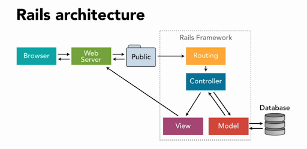
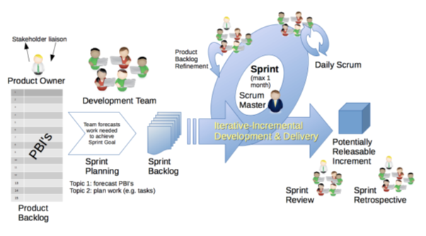

# T2A1 - WORKBOOK
#### By David Johnson

## Question 1 
```
Describe the architecture of a typical Rails application
```


Ruby on Rails follows a Model-View-Controller (MVC) architectural pattern and its two main principles are convention over configuration (also known as coding by convention) and DRY (don’t repeat yourself). 

A typical rails application has 6 basic architecture components which all have a distinct place in the applications folder structure:

1.	**Models** - contains the core functionality and data.  This is the application's dynamic data structure, independent of the user interface. It directly manages the data, logic and rules of the application.

2.	**Ruby on Rails Server** - is an executable that instantiates a Web Server and is used to accept the requests from the browser. Rails Server starts on your local machine and listens for requests on port 3000.

3.	**Routes** - comprise a way to tell which URL paths the application understands and which piece of code should handle the corresponding requests. The routes are configured inside a file called config/routes.rb and for each path the application needs to handle, a controller and action needs to be specified.

4.	**Controllers and their Actions** - handles the input from the user.  Accepts input and converts it to commands for the model or view

5.	**Views** - displays the information to the user and can be any representation of information such as a chart, diagram or table. Multiple views of the same information are also possible.

6.	**Assets** - are usually JavaScript code, CSS code and other media such as images.

## Question 2
```
Identify a database commonly used in web applications (including Rails) and discuss the pros and cons of this database
```
A database commonly used in web applications (including Rails) is SQLite.

**PROS:**

- SQLite is portable across all 32-bit and 64-bit operating systems and can be used with all programming languages without any compatibility issue. 

- It’s a very light weighted database so, it is easy to use it as an embedded software with devices like televisions, Mobile phones, cameras, home electronic devices, etc.

- It only loads the data which is needed, rather than reading the entire file and hold it in memory and also updates your content continuously so, little or no work is lost in a case of power failure or crash.  

- No need to install and configure it. Just download SQLite libraries in your computer and it is ready for creating the database.

**CONS:**

- As SQLite is a file-based data management system, it can cause performance issues with larger datasets because of file system limitations. 

- Database size is restricted to 2GB in most cases.

- There is a lack of multi-user capabilities which can be found larger relational database management systems like MySQL and PostgreSQL. 

- There is also a lack of granular access control, a friendly user management system, and security capabilities beyond encrypting the database file itself. 

## Question 3
```
Discuss the implementation of Agile project management methodology
```

Agile is a mix of constant planning, execution, learning, and iteration.  It focuses on iterative and incremental progress and provides flexibility for changes to the product as it continues to be developed. 

An example of implementing Agile methodology is as follows: 




• An Initiative Owner orders work on an Initiative Backlog, and the team plan to do some of it every iteration, known as a "Sprint". The most important items will be framed on a Sprint Backlog so an agreed Sprint Goal can be met. The Sprint Backlog is the team’s forecast of work for the Sprint. 

• The team hold Daily Scrums to ensure they are on course to meet the Goal. They update their Sprint Backlog forecast if needed. 

• The team reserve time during the Sprint to help the IO refine Initiative Backlog Items, so they can be planned into future Sprints. 

• The Sprint ends with a review of the increment and a retrospective of the team’s way of working, including the quality of “Done” work. 

• The Scrum Master removes impediments to the team’s progress. 
