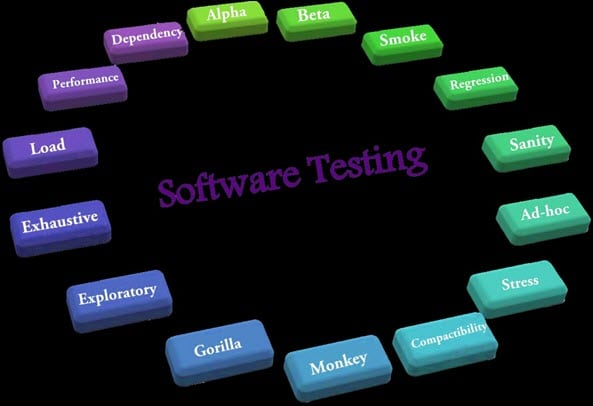

# T2A1 - WORKBOOK
#### By David Johnson

## Question 1 
```
Describe the architecture of a typical Rails application
```


Ruby on Rails follows a Model-View-Controller (MVC) architectural pattern and its two main principles are convention over configuration (also known as coding by convention) and DRY (don’t repeat yourself). 

A typical rails application has 6 basic architecture components which all have a distinct place in the applications folder structure:

1.	**Models** - contains the core functionality and data.  This is the application's dynamic data structure, independent of the user interface. It directly manages the data, logic and rules of the application.

2.	**Ruby on Rails Server** - is an executable that instantiates a Web Server and is used to accept the requests from the browser. The Rails Server starts on your local machine and listens for requests on port 3000.

3.	**Routes** - comprise a way to tell which URL paths the application understands and which piece of code should handle the corresponding requests. The routes are configured inside a file called config/routes.rb and for each path the application needs to handle, a controller and action needs to be specified.

4.	**Controllers and their Actions** - handles the input from the user.  Accepts input and converts it to commands for the model or view

5.	**Views** - displays the information to the user and can be any representation of information such as a chart, diagram or table. Multiple views of the same information are also possible.

6.	**Assets** - are usually JavaScript code, CSS code and other media such as images.

## Question 2
```
Identify a database commonly used in web applications (including Rails) and discuss the pros and cons of this database
```
A database commonly used in web applications (including Rails) is SQLite.

**PROS:**

- SQLite is portable across all 32-bit and 64-bit operating systems and can be used with all programming languages without any compatibility issue. 

- It’s a very light weighted database so, it is easy to use it as an embedded software with devices like televisions, Mobile phones, cameras, home electronic devices, etc.

- It only loads the data which is needed, rather than reading the entire file and hold it in memory and also updates your content continuously so, little or no work is lost in a case of power failure or crash.  

- No need to install and configure it. Just download SQLite libraries in your computer and it is ready for creating the database.

**CONS:**

- As SQLite is a file-based data management system, it can cause performance issues with larger datasets because of file system limitations. 

- Database size is restricted to 2GB in most cases.

- There is a lack of multi-user capabilities which can be found larger relational database management systems like MySQL and PostgreSQL. 

- There is also a lack of granular access control, a friendly user management system, and security capabilities beyond encrypting the database file itself. 

## Question 3
```
Discuss the implementation of Agile project management methodology
```

Agile is a mix of constant planning, execution, learning, and iteration.  It focuses on iterative and incremental progress and provides flexibility for changes to the product as it continues to be developed. 

In order to implement Agile, a team must gain stakeholder buy-in, choose a framework to follow and stick to it, change focus to empowering and motivating team members and revise and adjust as necessary.

An example of implementation of Agile methodology is as follows: 


• An Initiative Owner orders work on an Initiative Backlog, and the team plan to do some of it every iteration, known as a "Sprint". The most important items will be framed on a Sprint Backlog so an agreed Sprint Goal can be met. The Sprint Backlog is the team’s forecast of work for the Sprint. 

• The team hold Daily Scrums to ensure they are on course to meet the Goal. They update their Sprint Backlog forecast if needed. 

• The team reserve time during the Sprint to help the Initiative Owner refine Initiative Backlog Items, so they can be planned into future Sprints. 

• The Sprint ends with a review of the increment and a retrospective of the team’s way of working, including the quality of “Done” work. 

• The Scrum Master removes impediments to the team’s progress. 

• Rinse and repeat. 

## Question 4
```
Provide an overview and description of a standard source control process
```
Source control (or version control) is the practice of tracking and managing changes to code. 

A source code management (SCM) system is utilized to streamline the development process and to provide a centralized source for all of the code.

SCM systems allow the tracking of code changes, revision history for the code, and the ability to revert to previous versions of a project when needed. 

By using a SCM system, you can collaborate on code with your team, isolate your work until it is ready, and quickly trouble-shoot issues by identifying who made changes and what the changes were. 

A standard process for managing source control is as follows:
1.	Use a source control system.
2.	Keep your source code in source control 
3.	Ensure the working file is from the latest version of the source file.
4.	Only check-out the file being worked upon.
5.	Check in immediately after alterations are completed.
6.	Review every change before committing. 
7.	Commit often 
8.	Make extensive, detailed notes in the check-in comments about why the changes were made.

## Question 5
```
Provide an overview and description of a standard software testing process
```
There is no real standard when it comes to testing. 

The aim of any software testing process is to investigate, analyse and evaluate a piece of software and its features in order to detect the differences between existing and required conditions (defects/bugs/errors).  



There are many different types of testing concepts and practices that can be used to make sure an application is working correctly. A common method is **manual testing** - which falls under a testing type called a functional test.   These types of tests do not check the intermediate states of an action but instead focus on comparing the output to the expectations.   

In order to manually test something, a tester will start with a list of expectations and then personally test the application against that list.  A test passes when the tester gets back what was expected, and fails if it doesn't.  

Fails are recorded in detail, including specifics on how to recreate the failure.  These are then fed back into the development cycle as bugs to be fixed and are usually categorised by severity level – blocker, critical, major minor and cosmetic.

## Question 6
```
Discuss and analyse requirements related to information system security
```

Information System Security is necessary in order to prevent unauthorized access, use, disclosure, disruption, modification, inspection, recording or destruction of information – whether in a physical or electronic state.

The three main requirements for information system security are confidentiality, integrity and availability:

**Confidentiality**  refers to protecting information from being accessed by unauthorized parties.  It ensures that the necessary level of secrecy is enforced at each junction of data processing, thus preventing unauthorized disclosure.

**Integrity:**  ensures the accuracy, reliablitiy and authenticity of information.  It provides assurance that the source of the information is genuine and that it has not been altered through unauthorized modification.

**Availability:**  ensures reliability and timely access to data and resources is available to authorized individuals.

## Question 7
```
Discuss common methods of protecting information and data
```
There are many methods used to protect information and data.  The most common are as follows:

**Risk Assessment:** is the process of discovering, correcting and preventing security problems. It involves identifying various information assets that could be affected by a cyber-attack (such as hardware, systems, laptops, customer data etc.). And then identifies the various risks that could affect those assets.

**Access Controls:** This is effectively limiting employee access to sensitive data.  The fewer people who have access, the lesser the risk of data breach or loss.

**Encryption:** Data encryption applies a code to every individual piece of data and will not grant access to encrypted data without an authorized key being given

**Pseudonymisation:** is a technique that encodes personal data with artificial identifiers such as a random alias or code. It’s similar to writers who use pseudonyms to hide their identities.

**Data masking:** Masking specific areas of data to protect it from internal and external malicious sources.  For example, the first 12 digits of a credit card number may be masked within a database.

**Backups (Data resilience):** By creating backup copies, organizations can recover data should it be erased or corrupted accidentally or stolen during a data breach.

**Destruction:**  protects data against unauthorised recovery and access. Hard disks are most often destroyed using degaussing, whereas paper documents, CDs and tape drives are shredded into tiny pieces.  Encrypted data can easily be deleted simply by destroying the decryption keys.

## Question 8
```
Research what your legal obligations are in relation to handling user data
```

Business owners are responsible for protecting users' personal information from:
- theft
- misuse
- interference 
- loss
- unauthorised access
- modification
- disclosure

They are also responsible for securing, destroying or de-idenitfying the data when it's no longer required.

This is a legal requirement under the 
[Privacy Act 1988.](https://www.legislation.gov.au/Details/C2014C00076 "Privacy Act 1988")

The Privacy Act 1988 regulates the way individuals’ personal information is handled and gives them greater control over the process.

Under the Act, an individual has the right to: 

- know why their personal information is being collected, how it will be used and who it will be disclosed to

- have the option of not identifying themselves, or use of a pseudonym in certain circumstances

- ask for access to their personal information (including health information)

- stop receiving unwanted direct marketing

- ask for personal information that is incorrect to be corrected

- make a complaint about an organisation or agency the Privacy Act covers, if they think they’ve mishandled your personal information

The [Australian Privacy Principles](https://www.oaic.gov.au/privacy/australian-privacy-principles/australian-privacy-principles-quick-reference/ "APP") have been developed specifically to help organisations understand their obligations under the [Privacy Act](https://www.legislation.gov.au/Details/C2014C00076 "Privacy Act 1988")


```
"The Australian Privacy Principles (or APPs) are the cornerstone of the privacy protection framework in the Privacy Act 1988 (Privacy Act). They apply to any organisation or agency the Privacy Act covers.

There are 13 Australian Privacy Principles and they govern standards, rights and obligations around:

•	the collection, use and disclosure of 
    personal information

•	an organisation or agency’s governance and
    accountability

•	integrity and correction of personal information

•	the rights of individuals to access their   
    personal information

The Australian Privacy Principles are principles-based law. This gives an organisation or agency flexibility to tailor their personal information handling practices to their business models and the diverse needs of individuals. They are also technology neutral, which allows them to adapt to changing technologies.

A breach of an Australian Privacy Principle is an ‘interference with the privacy of an individual’ and can lead to regulatory action and penalties."

REFERENCE: https://www.oaic.gov.au/privacy/australian-privacy-principles
```
## Question 9
```
Describe the structural aspects of the relational database model. Your description should include information about the structure in which data is stored and how relations are represented in that structure.
```

## Question 10
```
Describe the integrity aspects of the relational database model. Your description should include information about the types of data integrity and how they can be enforced in a relational database.
```
## Question 11
```
Describe the manipulative aspects of the relational database model. Your description should include information about the ways in which data is manipulated (added, removed, changed, and retrieved) in a relational database.
```
## Question 12
```
Identify and explain the workings of TWO sorting algorithms and discuss and compare their performance/efficiency (i.e. Big O)
```
## Question 13
```
Identify and explain the workings of TWO search algorithms and discuss and compare their performance/efficiency (i.e. Big O)
```
## Question 14
```
Conduct research into a marketplace website (app) and answer the following parts:  a. What software is used by the app?
  b. What hardware is used by the app?
  c. Describe the interaction of technologies within the app
  d. Describe the way data is structured within the app
  e. Identify entities which must be tracked by the app
  f. Identify the relationships and associations between the entities you have identified in part (e)
  g. Design a schema using an Entity Relationship Diagram (ERD) appropriate for the database of this website (assuming a relational database model)
```